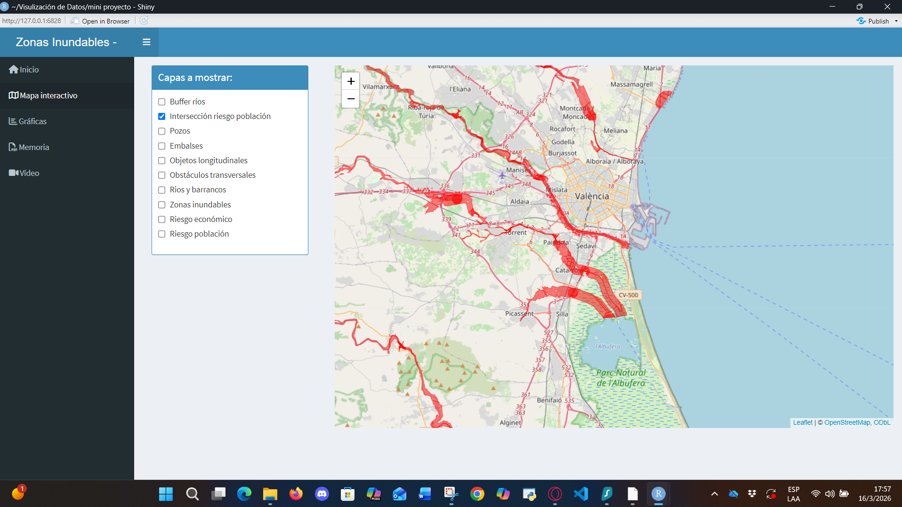
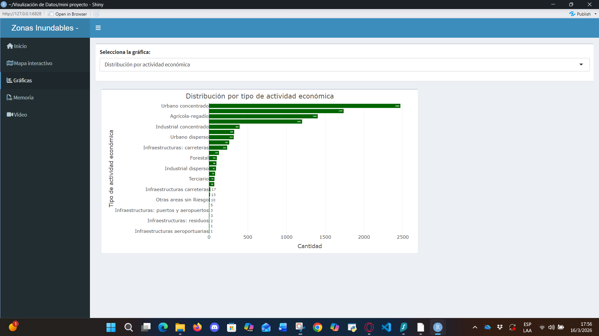
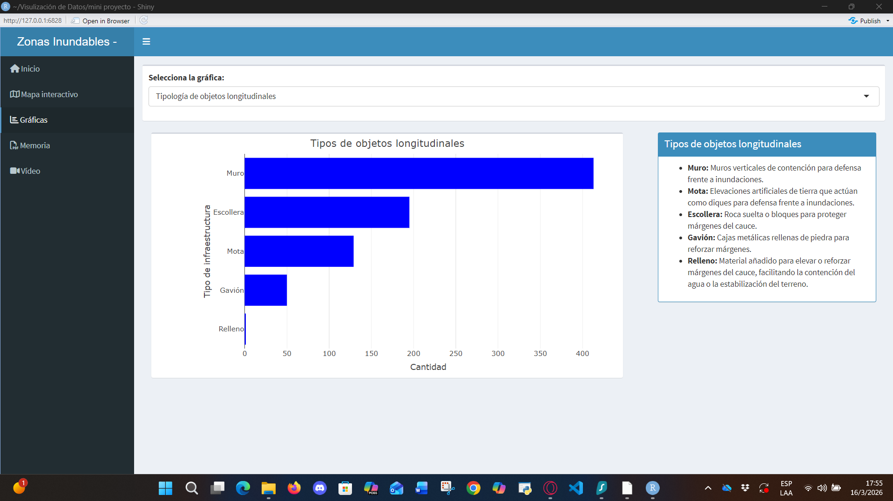

# DANA Valencia - Spatial Risk Analytics & Geo-Intelligence Dashboard


> **DANA Valencia** is a comprehensive analytical application (Shiny Dashboard) designed to visualize, interact with, and quantify hydrological risk in the Valencian Community. It evaluates the demographic and economic impact based on Return Period models (T10, T500) and identifies structural anomalies that amplify territorial risk.

---

## The Analytical & Business Challenge
During emergency management and urban planning, public administration consumes static reports (PDFs) that do not allow for real-time variable cross-referencing. 

The real challenge is not just mapping the water, but crossing that hydrological footprint against the urban fabric to answer critical questions: *What is the net economic impact over a 10-year period (T10)? Which municipalities will suffer the greatest population impact in an extreme event (T500)? Which specific infrastructures are aggravating the disaster?*

## The Solution
A spatial data pipeline (Spatial ETL) that ingests complex vector layers, reduces their dimensionality, and exposes them through a reactive web architecture. This allows decision-makers to filter, segment, and analyze economic and demographic risk through dynamic dashboards and interactive visualizations.

---

## Technical Architecture & Geoprocessing

### Phase 1: Topological Optimization (QGIS)
- **Vector Simplification:** Offline processing of shapefiles to drastically reduce the number of vertices (`_simplificado.shp`), minimizing server *payloads* and ensuring low latency in the web application.

### Phase 2: Spatial Computing (R & sf)
- **In-Memory Topological Operations:** Construction of interactive 500m buffers on riverbanks and execution of *Spatial Joins* against urban polygons to delimit net risk.
- **On-the-fly CRS Standardization:** Algorithmic reprojection from local coordinate systems to Web Mercator (EPSG:4326) for proper ingestion into Leaflet.

### Phase 3: Reactive Dashboard and UI/UX (Shiny, Leaflet & Plotly)
- **Conditional Rendering:** User Interface (UI) panels that dynamically adjust HTML legends and metrics based on the spatial context selected by the user.
- **Dynamic ColorRamps:** Real-time numerical mapping where visual intensity responds directly to the quantitative variables of ECONOMIC DAMAGE or POPULATION IMPACT.

---

## Key Findings & Analytical Impact

* **Municipal Vulnerability Ranking:** Identification and interactive sorting (via Plotly) of the Top 10 municipalities with the greatest direct population impact, enabling data-driven resource allocation.
* **Critical Infrastructure Diagnostics:** Real-time segregation of hydrological "bottlenecks" (walls, ripraps/embankments, culverts) acting as latent disaster amplifiers, facilitating the prioritization of demolitions or maintenance investments.
* **Digital Transition:** Evolution from static statistics and paper reports to a reactive and interactive *Single Source of Truth* (SSOT).

## Tech Stack
* **Spatial Data Wrangling:** `sf` (Simple Features) and `dplyr` libraries.
* **Web Development & UI:** R, Shiny (`shinydashboard`).
* **Interactive Visualization:** Leaflet (Web Maps) and Plotly (Dynamic analytical charts).
* **GIS Preprocessing:** QGIS.

---

## 🚀 How to run the Dashboard locally

To replicate the analysis environment and launch the web application locally:

1. Clone the repository:
```bash
git clone [https://github.com/tu-usuario/dana-valencia-dashboard.git](https://github.com/tu-usuario/dana-valencia-dashboard.git)
cd dana-valencia-dashboard
```
2. Install dependencies (R Console):
```R
install.packages(c("shiny", "shinydashboard", "leaflet", "sf", "dplyr", "plotly"))
```
3. Run the application:
```R
shiny::runApp("app.R")
```

## 📸 Dashboard Results & Demonstration

The Dashboard allows users to navigate between different dimensions of the disaster through an interactive side menu.

### 1. Real-Time Geospatial Intelligence (Leaflet)

> **Population Risk Intersection:** The user can dynamically overlay hazard layers. In this view, the spatial engine has crossed the water footprint against the urban fabric (Spatial Join), isolating and rendering in red the polygons where there is a direct risk to the population of Valencia and its metropolitan area.

### 2. Socioeconomic Impact Quantification

> **Data Wrangling & Aggregation:** Beyond the map, the system processes the metadata of the affected polygons. Here, the net distribution of impact by economic activity is visualized, revealing that "Concentrated Urban" and "Irrigated Agricultural" uses suffer the highest exposure—a critical *insight* for the allocation of government aid.

### 3. Infrastructure Diagnostics & Reactive UI

> **Conditional Panels and Vulnerability Analysis:** Upon selecting the "Longitudinal object typology" analysis, the dashboard not only generates the dynamic chart showing the prevalence of walls and embankments, but the Graphical User Interface (UI) also reacts by rendering a lateral information panel that explains the specific risk context.
